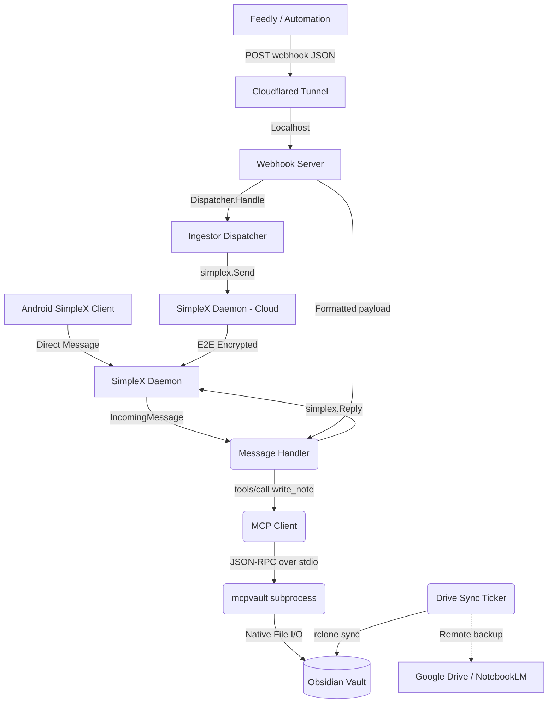

# Architecture and Design of Umbilical

This document outlines the architectural patterns, component responsibilities, and key technical decisions made during the development of Umbilical — a headless Go service that bridges SimpleX Chat and webhooks into a local Obsidian vault.

## 1. Overview

Umbilical is a lightweight Go background service designed to accept inputs from external platforms and route them as structured content into a local Obsidian vault.

It operates as a **Dual-Input Gateway**, supporting two primary ingestion pipelines:
1. **SimpleX Chat**: Real-time parsing of direct messages sent by a trusted SimpleX contact (e.g. your Android device).
2. **Feedly Webhooks**: Handling automated `NewEntrySaved` HTTP events triggered by Feedly, or any compatible generic webhook source.

Rather than managing file locks, frontmatter parsing, and the complexity of direct Markdown file manipulation, Umbilical relies entirely on the **Model Context Protocol (MCP)**. By acting as an MCP Client wrapped around a subprocess (like `@bitbonsai/mcpvault`), it safely issues JSON-RPC `write_note` and `read_note` commands, decoupling the ingestion logic from Obsidian's intricate file structure.

Additionally, to integrate with external LLM processors like Google's NotebookLM, an isolated synchronisation process replicates local markdown context to a cloud provider.

## 2. Deployment Roles

Umbilical supports three deployment modes via the `-role` flag, enabling a secure split-trust architecture:

| Role | Where it runs | Responsibilities |
|------|---------------|-----------------|
| `standalone` | Local machine | All features: webhook server, SimpleX listener, MCP writes, Drive sync |
| `ingestor` | Cloud server | Webhook ingestion + SimpleX forwarding to Executor; no vault access |
| `executor` | Local machine | SimpleX listener only; executes vault writes via MCP |

The split architecture ensures the Obsidian vault is never directly reachable from the public internet. The Ingestor acts as a dumb relay: it receives webhooks and forwards payloads to the Executor over SimpleX's end-to-end encrypted transport.

## 3. Core Components

### `main.go` — Orchestrator & Configuration
The entrypoint aggregates configuration from CLI flags or a consolidated JSON file (`-config`). It owns the lifecycle of the system context (`ctx`), spinning up concurrently running services (Webhook listener, SimpleX daemon, MCP subprocess, Drive Sync loop) and binding them via context cancellation for graceful shutdown on `SIGTERM`/`SIGINT`.

### `pkg/simplex/client.go` — SimpleX Daemon Manager
Manages a `simplex-chat` CLI subprocess over its WebSocket API.
- **Responsibilities**:
  - Start `simplex-chat` in maintenance mode (`-m`) and connect to it via WebSocket
  - Boot the chat layer with `/_start` and enable `auto_accept` for incoming contacts
  - `Listen`: Stream incoming `newChatItems` events and surface them as typed `IncomingMessage` values
  - `Send`: Connect to an Executor address and deliver a forwarded payload (ingestor role)
  - `Reply`: Send an acknowledgement back to an existing contact by display name
- **Why subprocess?**: SimpleX has no embeddable Go SDK. Spawning `simplex-chat` as a child process with a WebSocket control interface is the idiomatic integration path.

### `mcp/client.go` — The MCP Interface
Implements a minimal JSON-RPC 2.0 client over stdio for communicating with an MCP server subprocess.
- **Responsibilities**:
  - Manage the instantiation of a child process (the MCP server executable)
  - Inject runtime environment variables (e.g., `OBSIDIAN_VAULT_PATH`)
  - Safely marshal/unmarshal structured JSON queries mapping to standard `tools/call`
- **Why stdio?**: By avoiding network-bound components, a hardened, strictly-local process tree simplifies port orchestration and firewall considerations.

### `server/webhook.go` — HTTP Webhook Gateway
A standard `net/http` router defining the webhook integration endpoints.
- **Responsibilities**:
  - `POST /webhooks/feedly`: HMAC-SHA256 authenticated Feedly handler
  - `POST /webhooks/generic`: Bearer-token authenticated generic handler for Make.com, Zapier, IFTTT, etc.
  - Transform incoming JSON into the standard message routing format and proxy to the `MessageDispatcher`

### `server/ingestor_dispatcher.go` — SimpleX Relay Dispatcher
Used exclusively by the `ingestor` role to forward webhook payloads to the Executor.
- **Responsibilities**:
  - On `Handle(ctx, msg)`, call `simplexClient.Send(executorAddress, msg)` to relay the payload over SimpleX

### `handler/handler.go` — Content Routing Protocol
Translates string payloads (from SimpleX chat or webhook bodies) into concrete vault writes via MCP.
- **Responsibilities**:
  - Apply prefix-based categorisation: `!note` → `Inbox.md`, `!todo` → `Tasks.md`, `!link` → `Links.md`
  - Auto-detect raw URLs (no spaces, starts with `http://` or `https://`) → `Links.md`
  - Default route: `Daily/YYYY-MM-DD.md`
  - Deduplication: read the existing file before writing; if identical content is found, remove and re-append at the bottom (move-to-bottom semantic)
  - Date heading injection: group non-daily entries under a `## YYYY-MM-DD` heading per day

### `sync/drive_sync.go` — Passive Data Replication
A standalone background ticker decoupled from the primary ingest services.
- **Responsibilities**:
  - Periodically wake and trigger `rclone sync --create-empty-src-dirs` to mirror the `/Research` subdirectory to a configured cloud remote (e.g., Google Drive)

### `setup.go` — Interactive Setup Wizard
An interactive TUI (via `charmbracelet/huh`) that guides users through configuration and optionally auto-provisions the SimpleX daemon.
- **Responsibilities**:
  - Collect role, vault path, SimpleX profile, sender allowlist, webhook and sync settings
  - Optionally launch `simplex-chat` in maintenance mode, boot it, and extract the long-term contact address via WebSocket
  - Persist config to `~/.config/umbilical/config.json`

## 4. Key Architectural Decisions

### Delegating File I/O to the Model Context Protocol (MCP)
By migrating from direct `os` file operations to MCP, Umbilical treats Obsidian as a generic API rather than a raw filesystem.
- **Rationale**: Direct manipulation is fragile. Advanced Obsidian vaults contain intricate YAML frontmatters, index dependencies, and formatting standards. Using an MCP server (like `mcpvault`) shifts the maintenance burden of interacting with those nuances off this Go binary.

### SimpleX as the Messaging Layer
SimpleX Chat provides end-to-end encrypted, decentralised messaging with no central server, no phone number requirement, and a CLI daemon (`simplex-chat`) with a programmable WebSocket API.
- **Rationale**: Compared to Keybase (which requires account registration, team setup, and a bespoke Go SDK), SimpleX has a simpler operational model and stronger privacy properties. The WebSocket API is stable enough for subprocess control.

### Config File over Environment Variables
Secrets are stored in `~/.config/umbilical/config.json` (mode `0600`) rather than passed as CLI flags.
- **Rationale**: CLI flags inevitably expose secrets in `ps aux` output. A dedicated, user-owned config file is simpler and safer than injecting secrets via environment variables for a long-running service.

### Subprocess Execution for Replication (`rclone`)
The sync loop executes `rclone` as a subprocess rather than using a native Go Workspace SDK.
- **Rationale**: Implementing the full Workspace OAuth 2.0 flow natively in Go is significant overhead. `rclone` is the industry standard for lightweight storage synchronisation and supports dozens of backends — switching from Google Drive to Dropbox or S3 requires only a config change, not code changes.

## 5. Data Flow Graph

