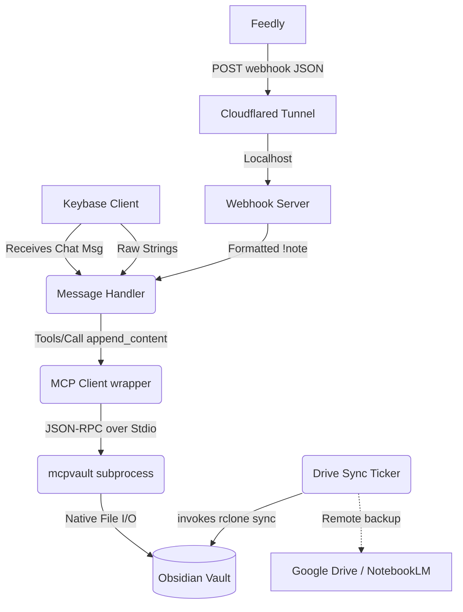

# Architecture and Design of Keybase-Obsidian Bot

This document outlines the architectural patterns, component responsibilities, and key technical decisions made during the development of the Keybase-Obsidian Bot as a headless service.

## 1. Overview

The Keybase-Obsidian Bot is a lightweight Go background service designed to accept inputs from external platforms and seamlessly route them as structured content into a local Obsidian vault.

It operates as a **Dual-Input Gateway**, supporting two primary ingestion pipelines:
1. **Keybase Chat**: Real-time parsing of direct messages sent to a dedicated Keybase bot account.
2. **Feedly Webhooks**: Handling automated "`NewEntrySaved`" server-to-server HTTP events triggered by Feedly enterprise webhooks.

Rather than managing file locks, frontmatter parsing, and the complexity of direct manipulation of local Markdown files, the bot relies entirely on the **Model Context Protocol (MCP)**. By acting as an MCP Client wrapped around a subprocess (like `@bitbonsai/mcpvault`), it safely issues JSON-RPC `append_content` commands, decoupling the bot's ingestion logic from Obsidian's intricate file structure.

Additionally, to integrate with external LLM processors like Google's NotebookLM, an isolated synchronisation process duplicates local markdown context to a cloud provider.

## 2. Core Components

### `main.go` - Orchestrator & Configuration
The entrypoint aggregates configurations originating from either standard CLI flags or a consolidated `.json` file (`-config`). It owns the lifecycle of the system context (`ctx`), spinning up concurrently running services (Webhook listener, MCP Subprocess, Drive Sync Loop, Keybase Message Listener) and binds them tightly via channels to facilitate graceful system shutdowns (`SIGTERM`/`SIGINT`).

### `mcp/client.go` - The MCP Interface
Implements a standardized, minimal JSON-RPC 2.0 client operating exclusively over Standard Input and Output (`stdio`) byte streams.
- **Responsibilities**: 
  - Manage the instantiation of a child process (the MCP Server executable).
  - Inject runtime environment variables (e.g., `OBSIDIAN_VAULT_PATH`).
  - Safely marshal/unmarshal structured JSON queries mapping to standard `tools/call`.
- **Why Stdio?**: By avoiding network-bound components, creating a hardened, strictly-local process tree dramatically simplifies port orchestration and firewall considerations.

### `server/webhook.go` - HTTP Webhook Gateway
A standard `net/http` router defining the Feedly integration endpoints.
- **Responsibilities**: 
  - Host a `POST /webhooks/feedly` handler.
  - Expose a strict `FeedlyAuthMiddleware` assessing `Authorization: Bearer <secret>`.
  - Transform unstructured Feedly JSON into the standardized markdown `!link` syntax and proxy it directly to the shared `MessageHandler`.

### `handler/handler.go` - Content Routing Protocol
Translates the string data (originating from either Keybase chat arrays or templated Feedly webhook bodies) into concrete logical pathways.
- **Responsibilities**: 
  - Apply prefix-based categorization (`!note` -> `Inbox.md`, `!todo` -> `Tasks.md`, `!link` -> `Links.md`).
  - Automatically detect and route raw URLs (starting with `http://` or `https://` and containing no spaces) to `Links.md`.
  - Dispatch the abstracted path and content to the `MCPClient` interface invoking the `append_content` tool.
  - Default route to `Daily/YYYY-MM-DD.md`.

### `sync/drive_sync.go` - Passive Data Replication
A standalone background ticker decoupled from the primary ingest services.
- **Responsibilities**:
  - Periodically wake and trigger `rclone sync --create-empty-src-dirs` to mirror the `/Research` subdirectory to a configured cloud remote (e.g., Google Drive) securely.

## 3. Key Architectural Decisions

### Delegating File I/O to the Model Context Protocol (MCP)
By migrating from direct `os` file operations to the MCP architecture, the bot treats Obsidian as a generic API rather than a raw filesystem. 
- **Rationale**: Direct manipulation is fragile. Advanced Obsidian vaults contain intricate YAML frontmatters, index dependencies, and formatting standards. Using an MCP Server (like `mcpvault`) shifts the maintenance burden of interacting with those nuances off this Go binary. The bot simply states "I want to append this content to this logical path."

### KBFS (Keybase File System) Native Configuration
Moving secrets to a config file (`config.json`) instead of parsing them from standard runtime flags was a strategic security choice.
- **Rationale**: Setting standard inputs like `-webhook-secret` inevitably dumps plaintext access tokens into `ps aux` command history. Relying on Keybase's built-in securely distributed KBFS volume allows the bot to ingest dynamic, end-to-end encrypted settings with minimal implementation overhead.

### Subprocess Execution for Replication (`rclone`)
When introducing a sync loop to Google Drive, we chose to execute the `rclone` binary via `exec.Cmd` rather than natively compiling a Go Google Workspace SDK script.
- **Rationale**: Implementing the full Workspace OAuth 2.0 flow natively in Go is significant overhead. `rclone` is the industry standard for lightweight storage protocols. Invoking it as a context-aware subprocess allows complete flexibility; if a user switches their grounding mechanism from Google Drive to Dropbox, only the CLI parameters change, requiring no Go code adjustments.

## 4. Data Flow Graph

